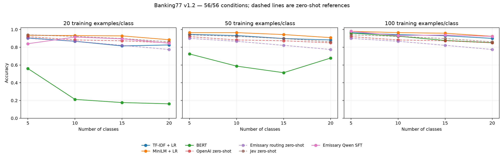

# Banking77 v2 experiment — v1.2 extended report

**56/56 quality conditions complete.** Fourteen method/budget variants across four label sets.

## Design and data integrity

Seed 42; nested label sets of 5/10/15/20 classes; 40 official held-out test examples/class (200/400/600/800 predictions per condition). The 28 new budget conditions add 14,000 predictions to the 28 earlier conditions. All methods within each K share identical test IDs, text and labels. The eligible pool contains 42 labels. See the [protocol](protocol.md) and [manifest](manifest.json).

TF-IDF+LR, frozen MiniLM+LR and BERT use 20/50/100 fit examples per class. Emissary Qwen3-4B-Base SFT uses 20/100 per class. OpenAI, Jev and Emissary routing remain zero-shot. Within each K, 20 ⊂ 50 ⊂ 100 training pools, with identical members across methods at equal budgets. Twenty-five additional examples/class remain reserved and unused for validation. Both regressions retain C=1; BERT retains two CPU epochs; Qwen retains one epoch and selects the last checkpoint. Hyperparameters are fixed rather than tuned independently for each budget. Qwen 20 starts from the pretrained base, not from the 100-shot model. These are training labels, not prompt demonstrations.

Offline checks passed for 16 historical supervised conditions and all 28 new conditions. There is no overlap of IDs, exact text, or text normalized with NFKC/casefold/collapsed whitespace between fit, reserved validation and test. Checks include the entire official test split and the recorded Qwen training uploads. [Audit evidence](data_integrity.json). This does not audit base-model pretraining, semantic duplicates or the provider’s internal processing.

## Accuracy by label budget

| Method | Fit/class | K=5 | K=10 | K=15 | K=20 |
| --- | ---: | ---: | ---: | ---: | ---: |
| TF-IDF + LR | 20 | 90.50% | 86.75% | 81.50% | 82.62% |
| TF-IDF + LR | 50 | 94.50% | 93.25% | 89.83% | 88.25% |
| TF-IDF + LR | 100 | 96.50% | 94.25% | 93.00% | 90.00% |
| MiniLM + LR | 20 | 93.50% | 93.25% | 92.83% | 88.50% |
| MiniLM + LR | 50 | 96.50% | 96.50% | 94.33% | 90.88% |
| MiniLM + LR | 100 | 98.00% | 96.50% | 95.83% | 92.38% |
| BERT | 20 | 56.00% | 21.25% | 17.67% | 16.25% |
| BERT | 50 | 72.50% | 58.75% | 51.33% | 67.88% |
| BERT | 100 | 96.00% | 92.50% | 87.67% | 85.12% |
| OpenAI zero-shot | 0 | 92.00% | 88.25% | 87.33% | 85.00% |
| Emissary routing zero-shot | 0 | 90.00% | 86.75% | 82.17% | 77.50% |
| Jev zero-shot | 0 | 94.00% | 92.25% | 89.83% | 86.12% |
| Emissary Qwen SFT | 20 | 84.00% | 91.50% | 89.50% | 84.50% |
| Emissary Qwen SFT | 100 | 98.00% | 93.25% | 93.83% | 92.25% |

## Interpretation

At equal 20/class budgets, MiniLM+LR has the highest accuracy and macro-F1 among the four supervised methods at every K. At equal 100/class budgets, MiniLM leads accuracy at K=10/15/20 and ties Qwen at K=5 (98.00%); Qwen has the slightly higher macro-F1 at K=5. These are point estimates; paired intervals below quantify uncertainty.

Qwen 100/class no longer has the highest accuracy at K=20 after adding MiniLM 100/class: 92.25% versus 92.38%. The difference is one prediction out of 800. At K=10/15, MiniLM 100/class scores 96.50%/95.83%, versus Qwen 93.25%/93.83%.

Qwen 20/class scores 84.00%, 91.50%, 89.50% and 84.50% accuracy. More labels improve Qwen in every K under this fixed one-epoch recipe. The low-budget K=5 result shows that quality is not monotonic in class cardinality.

BERT at 20/class scores 56.00%, 21.25%, 17.67% and 16.25% accuracy, while its 100/class variants score 96.00%, 92.50%, 87.67% and 85.12%. This characterizes the fixed two-epoch recipe; it does not establish the best achievable performance of a separately tuned BERT model.

Qwen SFT and Emissary routing are different models/mechanisms. Equal training budgets improve comparability among supervised methods; comparisons against zero-shot services still differ in supervision. Quick Train is not part of this benchmark.

## Full quality and calibration

OpenAI has no probabilities. Jev retains complete accuracy/F1 coverage but has 1/2/3 unavailable probability vectors at K=10/15/20; full-cohort calibration is unavailable there. The earlier recovery kept the 0.0001 sum tolerance and retained a class choice only when the sum was the sole invalidity and the choice was a maximum of finite nonnegative scores with positive total mass. No probabilities were renormalized. Recovery requested 970 missing IDs; historical and recovered timings remain separate.

| Method | K | Coverage | Accuracy [95% CI] | Macro-F1 | ECE | Adaptive ECE | Log loss | Brier |
| --- | ---: | --- | --- | ---: | ---: | ---: | ---: | ---: |
| TF-IDF + LR (20/class) | 5 | 200/200 (completed) | 90.50% [86.50%, 94.50%] | 0.904 | 0.453 | 0.453 | 0.858 | 0.411 |
| TF-IDF + LR (20/class) | 10 | 400/400 (completed) | 86.75% [83.50%, 89.75%] | 0.867 | 0.587 | 0.587 | 1.389 | 0.608 |
| TF-IDF + LR (20/class) | 15 | 600/600 (completed) | 81.50% [78.33%, 84.33%] | 0.814 | 0.610 | 0.610 | 1.725 | 0.702 |
| TF-IDF + LR (20/class) | 20 | 800/800 (completed) | 82.62% [80.00%, 85.00%] | 0.828 | 0.657 | 0.657 | 1.951 | 0.752 |
| TF-IDF + LR (50/class) | 5 | 200/200 (completed) | 94.50% [91.50%, 97.50%] | 0.945 | 0.356 | 0.356 | 0.600 | 0.264 |
| TF-IDF + LR (50/class) | 10 | 400/400 (completed) | 93.25% [90.75%, 95.50%] | 0.932 | 0.500 | 0.500 | 0.957 | 0.409 |
| TF-IDF + LR (50/class) | 15 | 600/600 (completed) | 89.83% [87.33%, 92.17%] | 0.899 | 0.544 | 0.544 | 1.206 | 0.498 |
| TF-IDF + LR (50/class) | 20 | 800/800 (completed) | 88.25% [86.00%, 90.38%] | 0.884 | 0.577 | 0.577 | 1.391 | 0.559 |
| TF-IDF + LR (100/class) | 5 | 200/200 (completed) | 96.50% [94.00%, 98.50%] | 0.965 | 0.279 | 0.279 | 0.439 | 0.180 |
| TF-IDF + LR (100/class) | 10 | 400/400 (completed) | 94.25% [92.00%, 96.25%] | 0.942 | 0.385 | 0.385 | 0.698 | 0.284 |
| TF-IDF + LR (100/class) | 15 | 600/600 (completed) | 93.00% [91.00%, 95.00%] | 0.930 | 0.444 | 0.444 | 0.881 | 0.355 |
| TF-IDF + LR (100/class) | 20 | 800/800 (completed) | 90.00% [88.00%, 91.88%] | 0.901 | 0.461 | 0.461 | 1.015 | 0.405 |
| MiniLM + LR (20/class) | 5 | 200/200 (completed) | 93.50% [90.00%, 96.50%] | 0.935 | 0.287 | 0.271 | 0.429 | 0.171 |
| MiniLM + LR (20/class) | 10 | 400/400 (completed) | 93.25% [90.75%, 95.50%] | 0.933 | 0.428 | 0.428 | 0.754 | 0.323 |
| MiniLM + LR (20/class) | 15 | 600/600 (completed) | 92.83% [90.83%, 94.67%] | 0.928 | 0.488 | 0.488 | 0.912 | 0.385 |
| MiniLM + LR (20/class) | 20 | 800/800 (completed) | 88.50% [86.38%, 90.62%] | 0.886 | 0.496 | 0.496 | 1.083 | 0.451 |
| MiniLM + LR (50/class) | 5 | 200/200 (completed) | 96.50% [94.00%, 98.50%] | 0.965 | 0.169 | 0.162 | 0.248 | 0.086 |
| MiniLM + LR (50/class) | 10 | 400/400 (completed) | 96.50% [94.75%, 98.25%] | 0.966 | 0.290 | 0.289 | 0.452 | 0.175 |
| MiniLM + LR (50/class) | 15 | 600/600 (completed) | 94.33% [92.50%, 96.17%] | 0.943 | 0.318 | 0.318 | 0.547 | 0.213 |
| MiniLM + LR (50/class) | 20 | 800/800 (completed) | 90.88% [89.00%, 92.62%] | 0.909 | 0.330 | 0.330 | 0.678 | 0.271 |
| MiniLM + LR (100/class) | 5 | 200/200 (completed) | 98.00% [96.00%, 99.50%] | 0.980 | 0.122 | 0.114 | 0.171 | 0.057 |
| MiniLM + LR (100/class) | 10 | 400/400 (completed) | 96.50% [94.75%, 98.25%] | 0.966 | 0.193 | 0.192 | 0.311 | 0.114 |
| MiniLM + LR (100/class) | 15 | 600/600 (completed) | 95.83% [94.17%, 97.33%] | 0.959 | 0.224 | 0.224 | 0.379 | 0.141 |
| MiniLM + LR (100/class) | 20 | 800/800 (completed) | 92.38% [90.62%, 94.00%] | 0.924 | 0.237 | 0.237 | 0.494 | 0.193 |
| BERT (20/class) | 5 | 200/200 (completed) | 56.00% [50.50%, 61.00%] | 0.513 | 0.281 | 0.281 | 1.388 | 0.697 |
| BERT (20/class) | 10 | 400/400 (completed) | 21.25% [18.75%, 23.50%] | 0.129 | 0.062 | 0.110 | 2.136 | 0.861 |
| BERT (20/class) | 15 | 600/600 (completed) | 17.67% [16.00%, 19.33%] | 0.093 | 0.065 | 0.084 | 2.471 | 0.896 |
| BERT (20/class) | 20 | 800/800 (completed) | 16.25% [14.75%, 17.75%] | 0.084 | 0.102 | 0.102 | 2.773 | 0.924 |
| BERT (50/class) | 5 | 200/200 (completed) | 72.50% [68.50%, 76.00%] | 0.655 | 0.357 | 0.357 | 1.114 | 0.565 |
| BERT (50/class) | 10 | 400/400 (completed) | 58.75% [55.25%, 62.25%] | 0.565 | 0.357 | 0.357 | 1.630 | 0.738 |
| BERT (50/class) | 15 | 600/600 (completed) | 51.33% [48.33%, 54.17%] | 0.470 | 0.335 | 0.335 | 1.936 | 0.795 |
| BERT (50/class) | 20 | 800/800 (completed) | 67.88% [65.38%, 70.25%] | 0.656 | 0.484 | 0.484 | 1.818 | 0.735 |
| BERT (100/class) | 5 | 200/200 (completed) | 96.00% [93.00%, 98.50%] | 0.960 | 0.229 | 0.224 | 0.348 | 0.131 |
| BERT (100/class) | 10 | 400/400 (completed) | 92.50% [90.00%, 94.75%] | 0.924 | 0.366 | 0.365 | 0.688 | 0.300 |
| BERT (100/class) | 15 | 600/600 (completed) | 87.67% [85.33%, 89.84%] | 0.873 | 0.329 | 0.329 | 0.749 | 0.311 |
| BERT (100/class) | 20 | 800/800 (completed) | 85.12% [83.00%, 87.25%] | 0.851 | 0.337 | 0.337 | 0.859 | 0.354 |
| OpenAI zero-shot | 5 | 200/200 (completed) | 92.00% [88.50%, 95.50%] | 0.919 | — | — | — | — |
| OpenAI zero-shot | 10 | 400/400 (completed) | 88.25% [85.49%, 91.00%] | 0.880 | — | — | — | — |
| OpenAI zero-shot | 15 | 600/600 (completed) | 87.33% [84.83%, 89.67%] | 0.874 | — | — | — | — |
| OpenAI zero-shot | 20 | 800/800 (completed) | 85.00% [82.75%, 87.12%] | 0.847 | — | — | — | — |
| Emissary routing zero-shot | 5 | 200/200 (completed) | 90.00% [86.00%, 93.50%] | 0.897 | 0.056 | 0.034 | 0.366 | 0.170 |
| Emissary routing zero-shot | 10 | 400/400 (completed) | 86.75% [83.75%, 89.75%] | 0.866 | 0.046 | 0.047 | 0.535 | 0.197 |
| Emissary routing zero-shot | 15 | 600/600 (completed) | 82.17% [79.33%, 85.00%] | 0.826 | 0.068 | 0.060 | 0.707 | 0.258 |
| Emissary routing zero-shot | 20 | 800/800 (completed) | 77.50% [74.88%, 80.00%] | 0.775 | 0.029 | 0.033 | 0.951 | 0.343 |
| Jev zero-shot | 5 | 200/200 (completed) | 94.00% [90.50%, 97.00%] | 0.940 | 0.042 | 0.042 | 0.621 | 0.099 |
| Jev zero-shot | 10 | 400/400 (completed) | 92.25% [89.75%, 94.75%] | 0.923 | — | — | — | — |
| Jev zero-shot | 15 | 600/600 (completed) | 89.83% [87.50%, 92.17%] | 0.899 | — | — | — | — |
| Jev zero-shot | 20 | 800/800 (completed) | 86.12% [84.00%, 88.12%] | 0.860 | — | — | — | — |
| Emissary Qwen SFT (20/class) | 5 | 200/200 (completed) | 84.00% [80.50%, 87.50%] | 0.820 | 0.068 | 0.065 | 0.441 | 0.215 |
| Emissary Qwen SFT (20/class) | 10 | 400/400 (completed) | 91.50% [88.75%, 94.00%] | 0.916 | 0.068 | 0.070 | 0.329 | 0.148 |
| Emissary Qwen SFT (20/class) | 15 | 600/600 (completed) | 89.50% [87.00%, 91.83%] | 0.895 | 0.055 | 0.054 | 0.364 | 0.164 |
| Emissary Qwen SFT (20/class) | 20 | 800/800 (completed) | 84.50% [82.25%, 86.75%] | 0.846 | 0.024 | 0.029 | 0.500 | 0.209 |
| Emissary Qwen SFT (100/class) | 5 | 200/200 (completed) | 98.00% [96.00%, 99.50%] | 0.980 | 0.008 | 0.008 | 0.064 | 0.030 |
| Emissary Qwen SFT (100/class) | 10 | 400/400 (completed) | 93.25% [90.50%, 95.50%] | 0.933 | 0.026 | 0.024 | 0.208 | 0.099 |
| Emissary Qwen SFT (100/class) | 15 | 600/600 (completed) | 93.83% [92.00%, 95.67%] | 0.938 | 0.038 | 0.031 | 0.241 | 0.098 |
| Emissary Qwen SFT (100/class) | 20 | 800/800 (completed) | 92.25% [90.50%, 93.88%] | 0.922 | 0.027 | 0.025 | 0.288 | 0.115 |

## Paired effects at equal budgets

Differences are method minus MiniLM+LR using the same training budget and test IDs. Positive values favor the named method. These exploratory comparisons do not adjust for multiplicity.

| Method | Fit/class | K | Δ accuracy [95% CI], pp | Δ macro-F1 [95% CI], pp |
| --- | ---: | ---: | --- | --- |
| TF-IDF + LR | 20 | 5 | -3.00 [-6.50, +0.00] | -3.02 [-6.53, +0.08] |
| TF-IDF + LR | 20 | 10 | -6.50 [-10.00, -3.00] | -6.59 [-10.09, -3.19] |
| TF-IDF + LR | 20 | 15 | -11.33 [-14.50, -8.33] | -11.35 [-14.54, -8.41] |
| TF-IDF + LR | 20 | 20 | -5.87 [-8.63, -3.25] | -5.78 [-8.51, -3.13] |
| TF-IDF + LR | 100 | 5 | -1.50 [-4.00, +0.50] | -1.49 [-3.96, +0.50] |
| TF-IDF + LR | 100 | 10 | -2.25 [-4.50, +0.00] | -2.36 [-4.63, -0.10] |
| TF-IDF + LR | 100 | 15 | -2.83 [-4.67, -0.83] | -2.83 [-4.68, -0.90] |
| TF-IDF + LR | 100 | 20 | -2.37 [-4.38, -0.38] | -2.26 [-4.27, -0.29] |
| BERT | 20 | 5 | -37.50 [-43.00, -31.99] | -42.20 [-48.34, -36.18] |
| BERT | 20 | 10 | -72.00 [-75.25, -68.75] | -80.40 [-83.96, -76.73] |
| BERT | 20 | 15 | -75.17 [-77.67, -72.50] | -83.51 [-86.15, -80.68] |
| BERT | 20 | 20 | -72.25 [-74.75, -69.88] | -80.24 [-82.47, -77.97] |
| BERT | 100 | 5 | -2.00 [-4.50, +0.00] | -2.01 [-4.59, +0.02] |
| BERT | 100 | 10 | -4.00 [-6.00, -2.00] | -4.11 [-6.24, -2.06] |
| BERT | 100 | 15 | -8.17 [-10.33, -6.00] | -8.60 [-11.00, -6.45] |
| BERT | 100 | 20 | -7.25 [-9.25, -5.25] | -7.28 [-9.37, -5.23] |
| Emissary Qwen SFT | 20 | 5 | -9.50 [-14.00, -5.00] | -11.46 [-16.78, -6.24] |
| Emissary Qwen SFT | 20 | 10 | -1.75 [-4.75, +1.00] | -1.68 [-4.68, +1.01] |
| Emissary Qwen SFT | 20 | 15 | -3.33 [-5.83, -0.83] | -3.26 [-5.78, -0.73] |
| Emissary Qwen SFT | 20 | 20 | -4.00 [-6.37, -1.50] | -4.00 [-6.37, -1.52] |
| Emissary Qwen SFT | 100 | 5 | +0.00 [-1.50, +1.50] | +0.00 [-1.50, +1.50] |
| Emissary Qwen SFT | 100 | 10 | -3.25 [-5.75, -1.00] | -3.31 [-5.69, -1.16] |
| Emissary Qwen SFT | 100 | 15 | -2.00 [-3.83, -0.33] | -2.02 [-3.84, -0.28] |
| Emissary Qwen SFT | 100 | 20 | -0.12 [-2.13, +1.75] | -0.13 [-2.23, +1.76] |

## Effect of increasing training labels

Differences are 100/class minus 20/class within a method, on the same test IDs. Epoch counts are fixed, so increasing the budget also increases optimization steps; this is not a compute-matched experiment.

| Method | Fit/class | K | Δ accuracy [95% CI], pp | Δ macro-F1 [95% CI], pp |
| --- | ---: | ---: | --- | --- |
| TF-IDF + LR | 100 | 5 | +6.00 [+3.00, +9.50] | +6.07 [+3.05, +9.56] |
| TF-IDF + LR | 100 | 10 | +7.50 [+5.00, +10.25] | +7.48 [+4.94, +10.28] |
| TF-IDF + LR | 100 | 15 | +11.50 [+8.83, +14.17] | +11.59 [+8.99, +14.43] |
| TF-IDF + LR | 100 | 20 | +7.37 [+5.25, +9.62] | +7.30 [+5.16, +9.44] |
| MiniLM + LR | 100 | 5 | +4.50 [+2.00, +7.50] | +4.54 [+2.01, +7.57] |
| MiniLM + LR | 100 | 10 | +3.25 [+1.50, +5.26] | +3.24 [+1.49, +5.31] |
| MiniLM + LR | 100 | 15 | +3.00 [+1.33, +4.83] | +3.07 [+1.35, +4.86] |
| MiniLM + LR | 100 | 20 | +3.87 [+2.25, +5.50] | +3.78 [+2.16, +5.40] |
| BERT | 100 | 5 | +40.00 [+34.00, +45.50] | +44.72 [+38.77, +50.73] |
| BERT | 100 | 10 | +71.25 [+68.00, +74.50] | +79.54 [+75.99, +83.11] |
| BERT | 100 | 15 | +70.00 [+67.17, +72.67] | +77.99 [+75.00, +80.82] |
| BERT | 100 | 20 | +68.88 [+66.25, +71.50] | +76.73 [+74.35, +79.12] |
| Emissary Qwen SFT | 100 | 5 | +14.00 [+10.50, +18.00] | +16.00 [+11.60, +20.91] |
| Emissary Qwen SFT | 100 | 10 | +1.75 [-1.00, +4.75] | +1.62 [-1.10, +4.48] |
| Emissary Qwen SFT | 100 | 15 | +4.33 [+2.00, +6.50] | +4.32 [+2.00, +6.57] |
| Emissary Qwen SFT | 100 | 20 | +7.75 [+5.50, +10.00] | +7.65 [+5.41, +9.95] |

## Operational measurements and costs

Inference uses batch size 1, concurrency 1, no warmup and no automatic retries. Model loading, training and deployment remain separate from prediction latency. `results.json` retains phase-specific p50/p95 latency and evidence locations with the training budget. Historical and new measurements are not pooled. Local methods use CPU with four numeric-library threads; provider hardware and hosted cache state are uncontrolled. No cross-provider speed or cost winner is established here. Unknown Emissary charges are unavailable, not zero. Original ledgers retain failed attempts and preparation costs.

## Limitations and reproducibility

One seed and previously observed test results make this an exploratory extension. Bootstrap intervals condition on fitted models, labels, class balance and campaign seed; they do not estimate training-seed variability. The 2,000 gold-stratified resamples use seed 20260925 and pointwise 95% percentile intervals without multiplicity adjustment. Test cohorts overlap across K and must not be pooled as independent observations. Definitions were assistant-reviewed, not independently human-validated. Changing K adds classes and examples, so trends do not isolate a causal cardinality effect.

All new measurements were executed by the user. Report generation only reads saved evidence and makes no provider calls. Original predictions remain unchanged. The publication version `v1.2` is distinct from the experiment directory name `v2`.

Render from the committed summary: `PYTHONPATH=src venv/bin/python scripts/build_v2_reports.py`. Add `--recompute` to recalculate from the local evidence bundle, including `artifacts/v2_budget_extension`. [Extension instructions](../../docs/budget_extension.md). The committed summary supports clean-clone rendering without raw datasets or credentials. Paired OpenAI comparisons are retained in `results.json`; source/model revisions and cohort identity are in the manifest. Report generation does not create tags or releases.
